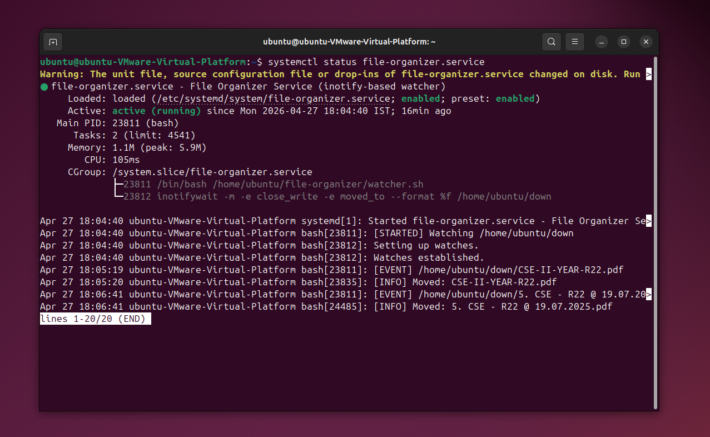
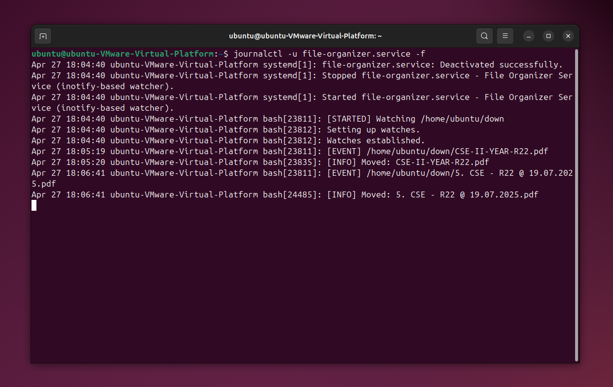
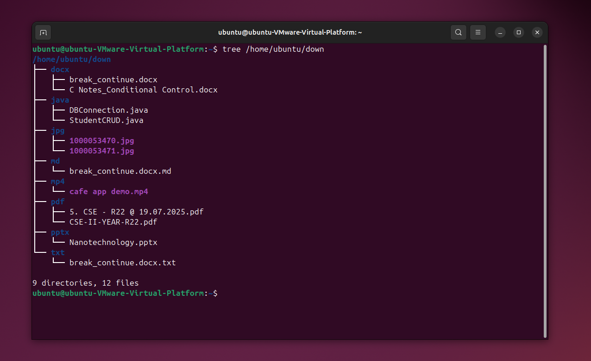

# 📁 File Organizer (Kernel-Triggered, systemd-Based)


---

## 🚀 Overview

A **kernel-event–driven file organizer** for Linux that automatically sorts files into folders based on their extensions.

Built using:

* Linux kernel events (**inotify**)
* Service management via **systemd**
* Python-based file processing

👉 When a file is downloaded or added, it is instantly organized.

---

## 🧠 Architecture

```text
Linux Kernel (inotify events)
        ↓
watcher.sh (systemd service)
        ↓
organizer.py (runs per file → exits)
```

---

## 📸 Screenshots

### 🔹 Service Running



### 🔹 Live Logs



### 🔹 Organized Output



---

## 📂 Project Structure

```bash
file-organizer/
│
├── organizer.py       # Python worker script
├── watcher.sh         # Kernel event listener
├── assets/            # Screenshots
└── README.md
```

---

## ⚙️ Installation

### 1️⃣ Clone the repo

```bash
git clone https://github.com/your-username/file-organizer.git
cd file-organizer
```

---

### 2️⃣ Install dependencies

```bash
sudo apt update
sudo apt install inotify-tools
```

---

### 3️⃣ Make scripts executable

```bash
chmod +x watcher.sh
chmod +x organizer.py
```

---

## ⚙️ Configuration

Edit `watcher.sh`:

```bash
WATCH_DIR="/home/ubuntu/down"
SCRIPT="/home/ubuntu/file-organizer/organizer.py"
```

---

## 📡 watcher.sh (Final Version)

```bash
#!/bin/bash

WATCH_DIR="/home/ubuntu/down"
SCRIPT="/home/ubuntu/file-organizer/organizer.py"

echo "[STARTED] Watching $WATCH_DIR"

while read FILE
do
    FULL_PATH="$WATCH_DIR/$FILE"
    echo "[EVENT] $FULL_PATH"

    /usr/bin/python3 "$SCRIPT" "$FULL_PATH" &
done < <(inotifywait -m -e close_write -e moved_to --format "%f" "$WATCH_DIR")
```

---

## ⚙️ systemd Setup

### 1️⃣ Create service file

```bash
sudo nano /etc/systemd/system/file-organizer.service
```

---

### 2️⃣ Add configuration

```ini
[Unit]
Description=File Organizer Service (inotify-based watcher)
After=network.target

[Service]
Type=simple
User=ubuntu
Group=ubuntu

WorkingDirectory=/home/ubuntu/file-organizer
ExecStart=/bin/bash /home/ubuntu/file-organizer/watcher.sh

Restart=always
RestartSec=3

StandardOutput=journal
StandardError=journal

Environment=PYTHONUNBUFFERED=1

[Install]
WantedBy=multi-user.target
```

---

### 3️⃣ Enable & Start

```bash
sudo systemctl daemon-reload
sudo systemctl enable file-organizer.service
sudo systemctl start file-organizer.service
```

---

## 📊 Usage

### Check service status

```bash
systemctl status file-organizer.service
```

---

### View logs

```bash
journalctl -u file-organizer.service -f
```

---

## 🧪 Testing

```bash
cp test.pdf /home/ubuntu/down/
```

OR download a file into the monitored directory.

---

## 📁 Output Example

```text
/home/ubuntu/down/
    ├── pdf/
    │   └── file.pdf
    ├── jpg/
    │   └── image.jpg
    └── txt/
        └── notes.txt
```

---

## 🧠 Key Concepts

| Concept         | Usage                |
| --------------- | -------------------- |
| Kernel Events   | inotify              |
| Daemon          | systemd              |
| Process Model   | One process per file |
| Synchronization | File readiness check |

---

## ⚠️ Notes

* Use **absolute paths only**
* Ensure watch directory exists:

```bash
mkdir -p /home/ubuntu/down
```

* Browser downloads require:

  * `close_write`
  * `moved_to`

---

## 🚀 Future Improvements

* Job queue / worker pool
* Batch processing
* Logging to file
* Pure Python daemon (no shell)
* systemd Path Units

---

## 📄 License

MIT License

---

## 👨‍💻 Author

Built as a **system-level automation project** using Linux internals.
